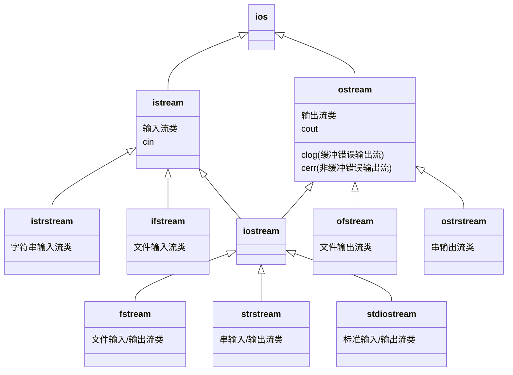

> by hui

## 类与对象

---

### 基础概念

1. **类（Class）**
   - 用户自定义的数据类型，是对象的蓝图
   - 包含数据成员（属性）和成员函数（方法Method）
   - 成员变量**不能在声明时直接赋值初始化**
   ```cpp
   class Student {
   private:
       string name;    // 数据成员
       int age;
   public:
       void display() { // 成员函数
           cout << name << ", " << age; 
       }
   };
   ```
   
2. **对象（Object）**
   - 类的实例化结果
   ```cpp
   Student stu1;      // 创建对象
   ```

---

### `this` 指针的本质

1. **隐式指针**  
   - 每个**非静态成员函数**中自动隐含的指针
   - 类型为：`ClassName* const`（常量指针）
   - 指向**当前调用该成员函数的对象实例**

2. **存储位置**  
   - 存储在函数调用的栈帧中（非对象内存的一部分）
   - 由编译器自动管理

---

#### 核心用途
1. 解决命名冲突
```cpp
class Person {
private:
    int age;
public:
    void setAge(int age) {
        this->age = age; // 明确指定成员变量
    }
};
```

 2. 返回对象自身引用（链式调用）
```cpp
class Calculator {
    int value;
public:
    //运算符重载
    Calculator& add(int n) {
        value += n;
        return *this; // 返回当前对象
    }
    Calculator& multiply(int n) {
        value *= n;
        return *this;
    }
};

// 链式调用
Calculator calc;
calc.add(5).multiply(2); 
```

3. 在成员函数中访问其他成员
```cpp
class MyClass {
    int x;
    void print() {
        cout << this->x; // 等价于 cout << x
    }
};
```

---

#### 关键特性
1. **不可修改性**  
   ```cpp
   this = nullptr; // 错误！this 是常量指针
   ```

2. **静态成员函数中不可用**  
   ```cpp
   class Demo {
   public:
       static void func() {
           cout << this; // 错误！静态函数没有 this 指针
       }
   };
   ```

3. **与对象生命周期绑定**  
   - 当对象被销毁后，`this` 指针变为悬垂指针

---

#### 进阶用法
1. 传递当前对象指针
```cpp
class NetworkRequest {
    void send() {
        api->process(this); // 将当前对象指针传递给外部系统
    }
};
```

 2. 实现自引用数据结构
```cpp
class TreeNode {
    TreeNode* left;
    TreeNode* right;
public:
    void linkNodes(TreeNode* l, TreeNode* r) {
        this->left = l;
        this->right = r;
    }
};
```


---

**典型问题**
1. `this` 指针可以为空吗？  
   - 当通过空指针调用成员函数时，若函数不访问成员变量，可能不会立即崩溃
   ```cpp
   class Test {
   public:
       void func() { cout << "OK"; }
   };
   Test* p = nullptr;
   p->func(); // 可能输出 OK，但属于未定义行为
   ```

2. 构造函数中能使用 `this` 吗？  
   - 可以，但需注意此时对象尚未完全构造完成


### 构造函数与析构函数

1. **构造函数**
   - 在对象创建时自动调用
   
   - 与类同名，无返回类型
   
   - 类型：
     - 默认构造函数
     - 参数化构造函数
     - 拷贝构造函数
     
     
     
 ```cpp
class Circle {
     public:
     Circle() { radius = 1.0; }          // 默认构造
     Circle(double r) { radius = r; }     // 参数化构造
     Circle(const Circle& c) {            // 拷贝构造
     	radius = c.radius;
     }
};
Circle::Circle(int r){...}
     
 //如果函数具有 class 类型的传值参数，那么调用该函数时，首先要拷贝构造函数
Circle::Circle(const Circle & p){...}
 ```

<<u>u>**拷贝构造函数：**</u>
	<u>**1.实参传递 非引用类型 **</u>
	<u>**2.函数返回 class类型 **</u>
	<u>3.**用 已知instance 初始化 新instance **</u></u>


1. **析构函数**

   - 对象销毁时自动调用
   - `~类名()`，无参数无返回值
   ```cpp
   ~Circle() {
       cout << "Object destroyed";
   }
   ```

2. **委托构造函数（C++11）**
   ```cpp
   Circle() : Circle(1.0) {}  // 委托给另一个构造函数
   ```

---

### 访问控制

1. **访问修饰符**
   - `public`：类外可直接访问
   - `private`：仅类内可访问（默认）
   - `protected`：类内和子类可访问

2. **友元（friend）**
   - 允许非成员函数访问私有成员
   - 友元可以访问类的所有成员，非对称，非传递，可以是一个函数，成员函数，一个类。
   - 没有this指针
   - 不是类的成员
   ```cpp
   friend void printRadius(Circle c);
   ```

---

### 类的成员

#### 1. **静态成员**

   - 类所有对象共享的成员
      1. 静态数据成员要**类中声明，类外定义**
   ```cpp
   class BankAccount {
       static int totalAccounts;  // 静态成员声明
   };
   int BankAccount::totalAccounts = 0;  // 静态成员定义
   ```
​	b. 静态成员函数没有this指针，<u>只能访问类的静态数据成员</u>，在类外可	用 “类名 :: ”作为限定词或通过对象调用

​        c. 无成员副本

#### 2. **常成员函数**

   - 不能修改对象状态的函数
   ```cpp
   double getArea() const {
       return 3.14 * radius * radius;
   }
   ```
   <u>常量对象只能调用常量成员函数</u>

**类的包含**
一个类将其他类的对象作为自己的成员变量，形成 "has-a"（拥有） 关系

核心特征：
生命周期一致：成员对象的创建/销毁与包含类对象完全同步
强所有权：被包含对象不能独立于包含类对象存在

先执行成员的构造函数，在执行自身构造函数

---
## operator overload

#### 重载

不能重载的： **.      .*     ::     ? :     sizeof**

= & 提供默认版本

重载不改变运算符的   **优先级， 结合性， 所需操作数的个数**

```cpp
void className::operator(参数列表) {
    // 操作实现
}
```

常用友元函数重载，（没有this指针

|      |一元运算|   二元运算   |
| ---- | ---- | ---- |
|      |   `++obj`   |    `l_obj + r_obj`  |
|   成员函数   | ` obj.operator ++() `   |   `l_obj.operator + (r_obj)`   |
|     友元函数 |    `operator++(obj)`   |    `operator+(l_obj, r_obj)`  |


**前置自增运算符**的重载函数原型通常如下（作为成员函数）：

```
ClassName& operator++();
```

它不接受参数，并且通常返回对调用对象自身的引用 (`ClassName&`)，因为返回的是自增后的当前对象。


**后置自增运算符**的重载函数原型通常如下（作为成员函数）：

```
ClassName operator++(int); // 注意这个 int 参数
```

它接受一个**伪参数 (dummy parameter) `int`**。这个 `int` 参数本身并没有实际意义，它仅仅是用来向编译器表明这是一个后置自增运算符的重载。后置自增通常返回一个**对象的值（副本）**，代表自增前的状态。


1. **常类名引用参数**：`f(const ClassName &)` 这种形式，`const` 修饰引用，对应的实参可以是常量、变量或表达式。因为 `const` 引用不修改实参，所以能接收多种形式。
2. **非常类名引用参数**：`f(ClassName &)` ，没有 `const` 修饰，意味着函数可能会修改实参，所以==**实参只能是变量**==，不能是常量或表达式，否则会引发错误。
3. **常类名参数**：`f(const ClassName)` ，参数是值传递，且为 `const` 类型，实参可以是常量、变量或表达式 ，函数内部不能修改该参数。
4. **类名参数**：`f(ClassName)` ，值传递的普通类参数，实参可以是常量、变量或表达式，函数接收实参的副本，对参数的修改不影响实参。 


==“ = ” ， “[ ]”, “()”, “->” 只能用**成员函数**重载==


重载()  调用：**对象 (表达式表)**

重载运算符函数调用需要作为**左值**时， 应当返回引用
```cpp
int & Vector::operator[] (int i) const{ //重载[], 返回元素引用
...
}
A[i] = i + 1 ;
```

重载“ **>>   <<”使用友元**,   因为要把Vector类对象作为运算符的右操作数， 引起调用函数是流类对象 ```cin``` or ```cout ```,  而不是Vector类的对象

**`(ostream&, const A&)`**参数顺序，应先输出流引用，再类 `A` 对象引用

```cpp
friend ostream & operator << ( ostream & output, const Vector & A){
	for(int i=0; i< A.len ; i++ ){
		output << A.v[i] << " ";
	}
	return output;
}
```

#### class 类型转换


 1. **转换构造函数（Converting Constructor）**
 `类名：：类名 (arg, arg1=E1,…,agrn=En);`
- **定义**：接受一个参数（或多个参数，但除第一个外均有默认值）的构造函数，用于将其他类型隐式或显式转换为当前类类型。
- **语法**：
  ```cpp
  class MyClass {
  public:
      MyClass(int x);          // 转换构造函数（允许隐式转换）
      explicit MyClass(double d); // explicit 禁止隐式转换
  };
  ```
- **隐式转换**：若未用 `explicit` 修饰，编译器会自动调用转换构造函数。
  ```cpp
  MyClass obj = 42; // 隐式调用 MyClass(int)
  ```
- **显式转换**：使用 `explicit` 时，必须显式调用构造函数。
  ```cpp
  MyClass obj = static_cast<MyClass>(3.14); // 显式转换
  ```

---

 2. **类型转换函数（Type Conversion Operator）**

    `operator T ()`
- **定义**：类的**成员函数**，用于将当前类类型转换为其他类型。
- **语法**：
  ```cpp
  class MyClass {
  public:
      operator int() const;       // 转换为 int（允许隐式转换）
      explicit operator bool() const; // explicit 要求显式转换
  };
  ```
- **隐式转换**：
  
  ```cpp
  MyClass obj;
  int x = obj; // 隐式调用 operator int()
  //int & x = obj ; int * x = obj ; x仍然是Myclass类型
  ```
- **显式转换**（C++11 起支持 `explicit`）：
  ```cpp
  if (static_cast<bool>(obj)) { ... } // 显式转换为 bool 
  ```
  static_cast 是 C++ 中用于显式类型转换的关键字，它在编译时进行类型检查，适用于相关类型之间的安全转换

---

4. **转换的二义性与解决**
- **场景**：当存在多个可能的转换路径时，编译器报错。
  ```cpp
  class A {
  public:
      A(int x);            // 转换构造函数：int → A
      operator int() const; // 转换函数：A → int
  };
  
  void func(A a);
  void func(int x);
  
  A obj;
  func(obj); // 二义性：A → int 或 A → A（直接匹配）
  ```
- **解决方法**：
  
  - 显式指定转换：
    ```cpp
    func(static_cast<int>(obj)); // 调用 func(int)
    func(A(42));                 // 调用 func(A)
    ```
  - 使用 `explicit` 减少隐式转换可能性。

---


- **转换构造函数**：
  ```cpp
  class Distance {
      int meters;
  public:
      explicit Distance(int km) : meters(km * 1000) {}
  };
  
  Distance d1 = 5;           // 错误：explicit 禁止隐式转换
  Distance d2 = Distance(5); // 正确：显式调用
  ```
- **类型转换函数**：
  
  ```cpp
  class Rectangle {
      int w, h;
  public:
      operator double() const { return w * h; }
  };
  
  Rectangle rect;
  double area = rect; // 隐式转换为 double
  ```


---
## 组合与继承

1. **组合（对象作为成员）**
   
   ```cpp
   class Engine { /*...*/ };
   class Car {
       Engine engine;  // 组合
   };
   ```
   
#### 2. **继承**

==默认是**private**继承==	

   ```cpp
   class A { //基类
   		private :
   			int x;
   };
   class B : public A { /* 派生类 */ };
   ```
​	protected成员： 屏蔽在类层次体系之中， 在派生类中可见， 在类外不可见

| 继承方式     | 基类 `public` 成员 | 基类 `protected` 成员 | 基类 `private` 成员 |
| ------------ | ------------------ | --------------------- | ------------------- |
| **公有继承** | `public`           | `protected`           | 不可访问            |
| **保护继承** | `protected`        | `protected`           | 不可访问            |
| **私有继承** | `private`          | `private`             | 不可访问            |

基类private成员不可见，但是不等于不存在, 可以间接访问
```cpp
A a, B b;
cout<< b.A::x ;
```


**基类中静态成员**属于类而非对象，基类定义的静态成员在整个类体系中共享（所有派生类共用同一份）


##### 访问声明

访问调节机制， 使得不可见成员变为可访问的

1.访问声明仅调整名字的访问权限， 不可声明类型

2.不能再派生类中降低或提升基类成员的可访问性

3.对重载函数名的访问声明将调整基类所有同名函数的访问域

4.**只有公有继承（`public inheritance`）允许隐式向上转型（基类指针 / 引用指向派生类对象**

```cpp
class X{
	public:
		f();
	private :
		f(int);
};
class Y: private X{
	public:
		X::f;  //错误！不同访问域的重载函数名不能访问声明；
		void f(int);
		X::f; //错误！与基类相同成员不可调整访问权限
}
```

**重名成员**
类名:: 成员   **屏蔽基类的同名成员**

==初始化： **基类构造→对象成员构造→派生类本身构造**==

==析构时：派生类本身→对象成员→基类==


---

##### 一、多继承（Multiple Inheritance）

**1. 定义**  
一个派生类（Derived Class）可以同时继承多个基类（Base Classes）。  
```cpp
class Base1 { /* ... */ };
class Base2 { /* ... */ };
class Derived : public Base1, public Base2 { /* ... */ };
```

---

**2. 多继承的构造与析构顺序**  
- **构造顺序**：按基类声明顺序初始化（从**左到右**），与派生类构造函数初始化列表中的顺序无关。  
- **析构顺序**：与构造顺序相反（从右到左）。  
```cpp
class Derived : public Base1, public Base2 {
public:
    Derived() : Base2(), Base1() {} // 实际构造顺序：Base1 → Base2 → Derived
};
```

---

**3. 成员名冲突**  
- 若多个基类有同名成员，需通过作用域运算符 `::` 明确指定来源。  
```cpp
class Base1 { public: void func(); };
class Base2 { public: void func(); };
class Derived : public Base1, public Base2 {
public:
    void callFunc() {
        Base1::func(); // 调用 Base1 的 func
        Base2::func(); // 调用 Base2 的 func
    }
};
```

---

**4. 多继承的典型问题：菱形继承（钻石问题）**  
- **场景**：派生类通过多个路径继承同一个基类，导致数据冗余和二义性。  
```cpp
class Animal { public: int age; };
class Lion : public Animal {};
class Tiger : public Animal {};
class Liger : public Lion, public Tiger {}; // 继承两份 age！
```

- **问题**：  
  ```cpp
  Liger liger;
  liger.age = 5; // 错误：age 有二义性（来自 Lion 还是 Tiger？）
  liger.Lion::age = 5; // 需显式指定路径
  ```

一个类**不能被多次说明为一个派生类的直接基类**，且可以不止一次成为间接基类（如通过不同继承路径）

---

##### 二、虚继承（Virtual Inheritance）

**1. 目的**  
解决菱形继承中的数据冗余和二义性，确保最终派生类只保留一份公共基类的成员。


**2. 语法**  
在继承时使用 `virtual` 关键字声明虚基类。  

```cpp
class Animal { public: int age; };
class Lion : virtual public Animal {};  // 虚继承
class Tiger : virtual public Animal {}; // 虚继承
class Liger : public Lion, public Tiger {}; // 仅保留一份 Animal 的 age
```
虚基类：在继承声明中使用 virtual 关键字修饰的基类（如 class Derived : virtual public Base）

---

**3. 虚继承的构造顺序**  
- **虚基类优先构造**：所有**虚基类**的构造函数会优先于非虚基类被调用。  
- ==the most derived class**最派生类负责初始化虚基类**==：直接派生类（如 `Lion` 和 `Tiger`）的构造函数对虚基类的初始化会被忽略。  
```cpp
class Animal {
public:
    Animal(int a) : age(a) {}
    int age;
};

class Lion : virtual public Animal {
public:
    Lion() : Animal(1) {} // 若创建 Liger 对象，此处的 Animal(1) 会被忽略！
};

class Tiger : virtual public Animal {
public:
    Tiger() : Animal(2) {} // 同理，被忽略
};

class Liger : public Lion, public Tiger {
public:
    Liger() : Animal(42) {} // 必须显式初始化虚基类
};

Liger liger;
cout << liger.age; // 输出 42（来自 Liger 的初始化）
```

---

**4. 虚继承的内存布局**  
- **虚基类指针（vbcPtr）**：每个虚继承的子类会包含一个指向虚基类子对象的指针。  
- **共享虚基类**：所有虚继承路径共享同一份虚基类实例。  

---


```cpp
#include <iostream>
using namespace std;

// 基类
class Animal {
public:
    Animal(int a) : age(a) {}
    int age;
};

// 虚继承
class Lion : virtual public Animal {
public:
    Lion() : Animal(1) { cout << "Lion constructed" << endl; }
};

class Tiger : virtual public Animal {
public:
    Tiger() : Animal(2) { cout << "Tiger constructed" << endl; }
};

// 最终派生类
class Liger : public Lion, public Tiger {
public:
    Liger() : Animal(42) { cout << "Liger constructed" << endl; }
};

int main() {
    Liger liger;
    cout << "Liger's age: " << liger.age << endl; // 输出 42
    return 0;
}
```

**输出结果**：  
```
Lion constructed  
Tiger constructed  
Liger constructed  
Liger's age: 42
```


| **特性**         | **多继承**                     | **虚继承**                          |
|------------------|-------------------------------|-------------------------------------|
| 主要用途          | 同时复用多个类的功能           | 解决菱形继承问题，共享基类数据       |
| 内存占用          | 可能冗余（菱形继承时）         | 额外虚基类指针，但数据唯一           |
| 构造顺序          | 按声明顺序初始化基类           | 虚基类优先初始化                     |
| 初始化责任        | 派生类初始化直接基类           | 最终派生类必须初始化虚基类           |
| 适用场景          | 接口继承、功能组合             | 需要消除数据冗余的复杂继承结构       |

- **多继承**：灵活但复杂，需谨慎设计。  
- **虚继承**：解决菱形继承问题，但增加复杂性。  
- **最佳实践**：优先使用组合，避免过度依赖继承。


---

## 多态与虚函数


静态联编**static binding** / 早期联编early binding。编译阶段就确定程序中的操作调用与执行该操作代码间的关系

派生类指针指向基类对象，基类对象不包含派生类的完整信息，不能隐式转换，**需要强制类型转换**

  e.g.3.当基类指针指向派生类对象时( )       
 A 发生语法错误  						  B 只能调用基类自己定义的成员函数      C 可以调用派生类的全部成员函数   		D 以上说法全部错误 

B，被声明为虚函数时可以调用重写的函数

当派生类指针指向基类对象时须强制将派生类指针转换成基类指针才能调用基类的成员函数

#### **虚函数**

实现dynamic binding 需要基类指针（或引用）调用虚函数

  定义特性：
  	
  1.派生类中可以省略virtual， 所有界面相同的重载函数都保持virtual
  2.必须是类的**成员函数**，不能是全局、静态函数 （依靠this指针实现动态联编dynamic binding
  3.不能申明为友元函数， 但可以是另一个类的友元
  4.可以是**析构函数**， 不能是构造函数


   ```cpp
   class Base {
   public:
       virtual void print() { cout << "Base" << endl; }
   };
   
   class Derived : public Base {
   public:
       void print() override { cout << "Derived" << endl; } // 重写虚函数
   };
   ```

2. **多态调用**  
   通过基类指针或引用调用虚函数时，实际执行的是对象所属派生类的版本：
   ```cpp
   Base* obj = new Derived();
   obj->print(); // 输出 "Derived"
   ```

通过基类指针或引用调用虚函数时，根据==`this`指针类型==（即指针实际指向对象所属的类）来识别类层次中不同类定义的虚函数版本

##### 重载特性

1.要求函数名、参数个数、参数类型、参数顺序以及函数返回值都必须与基类中的虚函数 **完全相同**


##### 虚析构函数

   - 若通过<u>基类指针删除派生类对象</u>，基类析构函数必须为虚函数，否则会导致派生类析构函数未被调用，引发内存泄漏。

在析构函数中调用虚函数时，由于对象已经开始销毁，此时采用**静态联编**

虚析构函数在通过基类指针删除派生类对象等情况下，可实现**动态联编**，正确释放派生类资源

当基类的析构函数是虚函数时，派生类的析构函数也会自动成为虚函数

   ```cpp
   class Base {
   public:
       virtual ~Base() {} // 虚析构函数
   };
   
   class Derived : public Base {
   public:
       ~Derived() { /* 清理派生类资源 */ }
   };
   
   Base* obj = new Derived();
   delete obj; // 正确调用 Derived 的析构函数
   ```

---

**二、虚函数的底层机制**

1. **虚函数表（vtable）**  
   - 每个包含虚函数的类都有一个**虚函数表**，表中按顺序存储该类所有虚函数的地址。
   - 编译器在编译时生成虚函数表，每个虚函数对应一个固定的索引位置。

2. **虚函数指针（vptr）**  
   - 每个对象实例化时，会隐式添加一个指向其类的虚函数表的指针（vptr）。
   - 对象的内存布局通常为：`vptr + 成员变量`。

   ```cpp
   // 假设 Base 类有虚函数 print() 和 func()
   Base obj;
   // 内存布局：
   // [vptr] → 指向 Base 的 vtable
   // [成员变量...]
   ```

3. **动态绑定过程**  
   调用虚函数时，程序通过以下步骤确定实际调用的函数：
   - 通过对象的 `vptr` 找到其类的虚函数表。
   - 根据虚函数在表中的索引位置，找到对应的函数地址。
   - 跳转到该地址执行函数代码。


2. **override 与 final 关键字**  
   - `override`：显式标记派生类重写的函数，确保签名与基类虚函数一致。
   - `final`：阻止派生类进一步重写虚函数，或禁止类被继承。

   ```cpp
   class Base {
   public:
       virtual void func() {}
   };
   
   class Derived : public Base {
   public:
       void func() override final {} // 禁止后续重写
   };
   
   class Child : public Derived {
   public:
       // void func() override {} // 错误：Derived::func 已标记为 final
   };
   ```


---

 **常见问题**
1. **切片问题（Slicing）**  
   - **现象**：派生类对象赋值给基类对象时，派生类特有部分被“切割”。
   - **解决**：使用基类**指针或引用**传递对象。

   ```cpp
   void process(Base obj);         // 错误：可能引发切片
   void process(Base& obj);        // 正确：通过引用传递
   ```

2. **默认参数静态绑定**  
   - 虚函数的默认参数在编译时确定，与动态绑定的函数体不一致时可能导致混淆。

   ```cpp
   class Base {
   public:
       virtual void log(int x = 1) { cout << x; }
   };
   
   class Derived : public Base {
   public:
       void log(int x = 2) override { cout << x; }
   };
   
   Base* obj = new Derived();
   obj->log(); // 输出 1（默认参数来自 Base，函数体来自 Derived）
   ```


####  Pure Virtual Function & Abstract class

---

##### **1. Pure Virtual Function**

- **定义**  
  纯虚函数是在基类中声明但没有具体实现的虚函数，其存在是为了强制派生类必须重写（override）该函数，形成统一的接口规范。

- **语法**  
  ```cpp
  virtual 返回类型 函数名(参数列表) = 0;
  
  virtual void draw() const = 0; // 纯虚函数
  ```
  
- **特性**  
  
  - 纯虚函数没有函数体。
  - 包含纯虚函数的类称为**抽象类**，无法实例化。
  - 派生类必须实现所有纯虚函数，否则派生类也会成为抽象类。

---

##### 2.**Abstract Class**

- **定义**  
  包含至少一个纯虚函数的类称为抽象类。抽象类用于定义接口规范，强制派生类实现特定功能。

- **特性**  
  - **不能被实例化**：`Shape shape;` 会导致编译错误。
  - **必须被继承**：派生类需实现所有纯虚函数才能实例化。
  - **可包含其他成员**：可以有普通成员变量、非虚函数和已实现的虚函数。
  - Abstract Class 可以指向不同的派生类
  
- **示例**  
  ```cpp
  class Shape { // 抽象类
  public:
      virtual double area() const = 0; // 纯虚函数
      void print() { cout << "Shape"; } // 普通成员函数
  };
  
  class Circle : public Shape {
  public:
      double area() const override { // 必须实现纯虚函数
          return 3.14 * radius * radius;
      }
  private:
      double radius;
  };
  ```


---

**4. 注意事项**
1. **纯虚函数可以有实现**  
   C++11允许为纯虚函数提供默认实现（通过派生类显式调用）：
   ```cpp
   virtual void log() const = 0 { /* 默认实现 */ }
   ```
2. **抽象类的析构函数**  
   抽象类的析构函数应声明为虚函数，确保正确释放资源：
   ```cpp
   virtual ~Shape() = default;
   ```
3. **不能直接实例化**  
   试图创建抽象类对象会导致编译错误：
   ```cpp
   Shape shape; // 错误：Shape是抽象类
   ```
4. **可包含非纯虚函数**  
   抽象类可以混合纯虚函数和非纯虚函数。

---


| **特性**         | **纯虚函数**               | **抽象类**                     |
|-------------------|--------------------------|------------------------------|
| **定义**          | 无实现的虚函数（`=0`）     | 包含至少一个纯虚函数的类        |
| **实例化**        | 不能直接调用              | 不能实例化                    |
| **派生类要求**    | 必须重写纯虚函数           | 必须实现所有纯虚函数            |
| **核心作用**      | 强制接口规范              | 提供多态基础和代码复用          |


#### 异质链表Heterogeneous Linked List

用抽象类指针构造派生类对象链表

`Employee *employ[1000]`  其中数组元素为基类指针， 因为基类指针可以指向派生类对象（要有默认构造函数


---

## 模板Template

- **定义**：模板是 C++ 的一种泛型编程机制，可以让你编写与类型无关的代码，从而实现代码复用。  
- **两大类型**：  
  - **函数模板**：用于对函数进行泛型化。  
  - **类模板**：用于对类进行泛型化。

- **语法**：  
  模板定义一般形式如下：
  
  ```cpp
  template <typename T>
  // 或者 template <class T>
  ```
  ```cpp
  template <typename T, typename U>
  ```

---

#### 函数模板

 示例：交换两个变量的值

```cpp
template <typename T>
void swap(T &a, T &b) {
    T temp = a;
    a = b;
    b = temp;
}
```
- 当你调用 `swap(3, 4)` 时，编译器会根据参数类型生成对应的 `swap<int>` 实例。

自动类型推导（实例化由编译器实现

- 调用函数模板时无需显式指定模板参数，编译器会根据实参类型自动推导。但在某些情况下可能需要显式指定（例如模棱两可的情况）。
- 类型不一致可以重载函数

---

#### 类模板

类模板使得类能够与类型参数泛化，常用于容器、算法等实现。

示例：简单的容器类
```cpp
template <typename T>
class MyContainer {
private:
    T *data;// 使用类属参数 T 
    int size;
public:
    MyContainer(int n) : size(n) {
        data = new T[n];
    }
    ~MyContainer() {
        delete[] data;
    }
    T& operator[](int index) {
        return data[index];
    }
    // 其他成员函数……
};
```
- 通过使用模板参数 `T`，类可以存储任意类型的数据。

##### **类模板与友元**
1.模板类的友元
一般函数，函数模板；类、类模板的成员函数都可以是友元

```cpp
template<typename T> class X
{ //...
	friend void f1(){}	//一般函数
	
	template<typename T> friend void f2(X<T> &){} // 函数模板作友元
	
	friend void A::f3(){} // 类A的成员函数作友元
	
	template <typename T> friend void B<T> :: f4(X<T> &){}//另一个类模板的成员函数

}
```


2.模板类的友元类
友元可以是 类/类模板
```cpp
template<typename T> class X
{
	friend class Y;
	
	template<typename T> friend class Z; 
	//使Z<T>的所有成员函数成为友元
}
```


##### **类模板与静态成员**
每一个实例化的模板类（如 `MyClass<int> `和 `MyClass<double>`）
**都有自己的静态数据成员副本**
也应该在文件范围内定义和初始化


---


#### 类型转换

类型转换是模板的一大考点：

隐式类型转换：
即类似于char和int的转换

```c++
char a='a';
void sd(int);
sd(a);
```

强制类型转换：
即

```c++
int a=1;
char b='a';
b=(char)a;
强制类型转换，需要强制类型转换符，如：(char)a。
```

体现在模板上，就是

```c++
T add(vector<T> a, T b){
    return b;
}
add<int>(a,b);
```


#### 重载

可以实现重载
当函数模板和普通函数重名时，编译器会优先选择函数模板，除非使用空模板参数列表。

```c++
template <typename T>
T add(T a, T b)
{
}
int add(int a, int b)
{
}
int main()
{
    add<>(int a=1,int b=0);
}
<>记为空模板参数列表。
```


#### 模板特化

模板特化允许你为特定类型提供特定实现。

##### 1. 完全特化（Full Specialization）

对于特定类型，提供完全定制化的版本。

```cpp
template <>
class MyContainer<bool> {
private:
    unsigned char *data; // 用位来储存布尔值的特化实现
    int size;
public:
    MyContainer(int n) : size(n) {
        data = new unsigned char[(n + 7) / 8];
    }
    ~MyContainer() {
        delete[] data;
    }
    // 重写相关接口……
};
```

##### 2. 偏特化（Partial Specialization）

仅对模板参数的一部分进行特化。常见于多参数模板中。

```cpp
template <typename T, typename U>
class MyPair {
public:
    T first;
    U second;
    MyPair(T a, U b): first(a), second(b){}
};

// 偏特化版本：当第二个类型为 int 时
template <typename T>
class MyPair<T, int> {
public:
    T first;
    int second;
    MyPair(T a, int b): first(a), second(b){}
    // 针对 int 类型优化某些操作
};
```

---

#### 非类型模板参数

非类型模板参数可以是整数、枚举、指针或引用等，不依赖于类型。

示例：固定大小数组的模板类
```cpp
template <typename T, int Size>
class Array {
private:
    T data[Size];
public:
    int size() const { return Size; }
    T& operator[](int index) { return data[index]; }
};
```
- 调用示例：`Array<int, 10> arr;` 创建一个能容纳 10 个整数的数组。


 可变参数模板（Variadic Templates）

C++11 引入的可变参数模板可以使模板接受任意数量的模板参数，非常适合实现递归或展开操作。

示例：打印任意参数的函数
```cpp
#include <iostream>

void print() {
    cout << "\n";
}

template <typename T, typename... Args>
void print(T first, Args... args) {
    cout << first << " ";
    print(args...); // 递归调用，直到参数耗尽
}
```
- 上述代码利用递归和参数包展开，实现了任意数量参数的打印功能。


---


 注意事项

1. 成员变量初始化优先使用初始化列表：
   ```cpp
   Circle(double r) : radius(r) {}
   ```

2. 深拷贝 vs 浅拷贝：
   - 当类包含指针成员时，必须自定义拷贝构造函数

3. 虚析构函数：
   ```cpp
   virtual ~Base() {}  // 确保正确调用派生类析构函数
   ```

4. 对象生命周期管理：
   - 优先使用智能指针（unique_ptr/shared_ptr）

---

 对象内存模型

1. 对象大小 = 所有非静态成员变量大小之和 + 内存对齐
2. 成员函数不占用对象内存（存储在代码区）
3. 虚函数通过虚函数表（vtable）实现

---

## 输入输出流

### 一、流类与流对象

C++ 的流（Stream）机制基于一棵清晰的类继承体系，以 `ios_base` 为根，衍生出 `ios`、`istream`、`ostream`、`iostream` 及相应的文件与字符串流类，实现了统一的输入输出接口



常用的全局流对象包括：

- `cin`（标准输入）
- `cout`（标准输出）
- `cerr`（无缓冲标准错误输出）
- `clog`（有缓冲标准错误输出）

------

### 二、标准流与基本操作

C++ 将所有输入/输出操作视为对流的读取或写入，支持链式操作与操作符重载。
- 默认情况下，`cin` 会跳过空白字符；如需读取整行可用 `getline(cin, str)`。
- 在多次输入后应检测 `cin.fail()`、`cin.clear()` 以确保无残留错误状态。

#### 输入流操作

`istream` 公有成员函数

| 函数         | 功能                                                         |
| ------------ | ------------------------------------------------------------ |
| `operator>>` | 提取运算符                                                   |
| `get()`      | 从流中提取字符，包括空格;     return EOF                     |
| `getline()`      |从流中提取一行字符，直到遇到分隔符 。                        |
| `read()`     | 无格式输入，读取指定字节数到字符数组                         |
| `ignore()`   | 提取并丢弃流中指定数量的字符                                 |
| `peek()`     | 返回流中下一个字符，但不从流中删除该字符                     |
| `gcount()`   | 返回最后一次非格式化输入操作（如 `read`、`getline`）读取的字符个数 |
| `eatwhite()` | 忽略前导空格                                                 |
| `seekg()`    | 移动输入流的读指针到指定位置                                 |
| `tellg()`    | 返回输入流读指针的当前位置                                   |

1.`int get()`

2.`istream& get(char & ch)` 提取字符，写入rch

3.`istream & get(char * pch, int n, char dilim = '\n')` 从当前字符开始，提取n-1个字符 or 遇到delim后结束，写入pch

4.`istream& getline(char * pch, int n, char delim = '/n')`

5.`istream& read(char * pch, int n)` 提取n长度的字节序列赋给pch（地址


#### 输出流操作

| 函数       | 功能                         |
| ---------- | ---------------------------- |
| put        | 无格式，插入一个字节         |
| **write**  | 从无格式，插入一字节序列     |
| flush      | 刷新输出流                   |
| `seekp`    | 移动输出流指针               |
| `tellp`    | 返回输出流中指定位置的指针值 |
| operator<< | 插入运算符                   |

```cpp
ostream & put(char ch)

ostream& write( const char* pch, int nCount );
ostream& write( const unsigned char* puch, int nCount );
ostream& write( const signed char* psch, int nCount ); 

```

#### 流错误状态

| **标识常量** | **值**   | **意义**                              |
| ------------ | -------- | ------------------------------------- |
| `goodbit  `  | **0x00** | **状态正常**                          |
| `eofbit `    | **0x01** | **文件结束符**                        |
| ` failbit  ` | **0x02** | **I/O操作失败，数据未丢失，可以恢复** |
| ` badbit  `  | **0x04** | **非法操作，数据丢失，不可恢复**      |

| 函数                                           | 功能                                               |
| ---------------------------------------------- | -------------------------------------------------- |
| `int eof() const;`                             | 返回 eofbit 状态值。文件结束符时返回 1，否则返回 0 |
| `int fail() const;`                            | 返回 failbit 状态值                                |
| `int good() const;`   `int operator void *();` | eofbit、failbit 和 badbit 都没有被设置，则返回 1   |
|                                                |                                                    |
| `int bad() const;`    `int operator!();`       | eofbit、failbit 或 badbit 其中一个被设置，则返回 1 |
|                                                |                                                    |
| `int rdstate() const;`                         | 返回状态字                                         |
| `void clear( int nState = 0 );`                | 恢复或设置状态字                                   |


### 三、格式控制（Formatting）

可以通过ios类的成员函数设置标志字，或者使用<iomanip>库中的操纵符来控制输入输出的格式。

**设置标志字 **

| 状态标志     | 值     | 含义                               | 输入 / 输出 |
| ------------ | ------ | ---------------------------------- | ----------- |
| skipws       | 0X0001 | 跳过输入中的空白                   | I           |
| left         | 0X0002 | 左对齐输出                         | O           |
| right        | 0X0004 | 右对齐输出                         | O           |
| internal     | 0X0008 | 在符号位和基指示符后填入字符       | O           |
| ==dec==      | 0X0010 | 转换基制为十进制                   | I/O         |
| ==oct==      | 0X0020 | 转换基制为八进制                   | I/O         |
| ==hex==      | 0X0040 | 转换基制为十六进制                 | I/O         |
| **showbase** | 0X0080 | 在输出中显示基指示符               | O           |
| showpoint    | 0X0100 | 输出时显示小数点                   | O           |
| uppercase    | 0X0200 | 十六进制输出时一律用大写字母       | O           |
| **showpos**  | 0X0400 | 正整数前加 “+” 号                  | O           |
| scientific   | 0X0800 | 科学示数法显示浮点数               | O           |
| fixed        | 0X1000 | 定点形式显示浮点数（四舍五入       | O           |
| unitbuf      | 0X2000 | 输出操作后立即刷新流               | O           |
| stdio        | 0X4000 | **输出操作后刷新stdout 和 stdree** | O           |


**ios** **控制格式的函数**

| 函数                                  | 功能                                          |
| ------------------------------------- | --------------------------------------------- |
| long flags( long lFlags );            | 用参数 lFlags 更新标志字                      |
| long flags() const;                   | 返回标志字                                    |
| long setf( long lFlags );             | 设置 lFlags 指定的标志位                      |
| long setf( long lFlags, long lMask ); | 将 lMask 指定的位清 0，然后设置 lFlags 指定位 |
| long unsetf( long lMask );            | 将参数 lMask 指定的标志位清 0                 |
| int width( int nw );                  | 设置下一个输出项的显示宽度为 nw               |
| char fill( char cFill );              | 空白位置以字符参数 cFill 填充                 |
| int precision( int np );              | 用参数 np 设置数据显示精度                    |


**格式控制符 (Manipulators)**

- **<iostream>常用控制符**

- endl：输出换行符并刷新流 。
- ends：输出空字符\0并刷新流 。
- flush：刷新流缓冲区 。
- dec：10   oct：8  hex：16
- ws：提取并丢弃前导空白字符 。

 `<iomanip>` 

| 操纵符                           | 功能                                   |
| -------------------------------- | -------------------------------------- |
| `setw(n)`                        | 设置下一个输出字段宽度为 `n`（右对齐） |
| `setfill(c)`                     | 设置填充字符为 `c`                     |
| `setprecision(n)`                | 设置浮点数总有效位或小数位数           |
| `fixed`                          | 固定小数位模式                         |
| `scientific`                     | 科学计数法                             |
| `left`/`right`                   | 左对齐 / 右对齐                        |
| `boolalpha`/`noboolalpha`        | 布尔值显示为 true/false 或 1/0         |
| `resetiosflags(ios::lFlags  )  ` | 清除`lFlags`指定的标志位               |
| `setiosflags( ios::lFlags)`      | **设置`lFlags`指定的标志位**           |
| `setbase(int base)`              | 设置基数，hex=16，oct=8，dec=10        |


```cpp
#include <iostream>
#include <iomanip>
using namespace std;

cout << setw(10) << setfill('*') << 42 << endl;         // ****42
cout << fixed << setprecision(3) << 3.1415926 << endl;   // 3.142
```

------

### 四、串流（String Stream）

字符串流位于 `<sstream>` 头文件中，通过 `istringstream`、`ostringstream` 及 `stringstream` 类，可将 `string` 当作流来解析或构造字符串。

**串流类是** **ios** **中的派生类**

**C++**的串流对象可以连接**string**对象或字符串

串流提取数据时对字符串按**变量类型**解释；

**插入数据时把类型数据转换成字符串**/格式化ASC

**串流I/O**具有格式化功能

- **解析字符串**

  ```cpp
  string line = "100 Alice 98.6";
  istringstream iss(line);
  int id; string name; double score;
  iss >> id >> name >> score;
  ```

- **构造字符串**

  ```cpp
  ostringstream oss;
  oss << "ID=" << id << ", Name=" << name;
  string result = oss.str();
  ```
  


 #### istringtream
`istringstream` 是一个字符串输入流类，主要用于将字符串解析为其他数据类型。下面详细介绍其用法：

 基本语法

需要包含头文件：
```cpp
#include <sstream>
```

主要用途

1. **字符串分割**
````cpp
#include <sstream>
#include <string>
using namespace std;

int main() {
    string str = "hello world 123";
    istringstream iss(str);
    string word;
    
    while (iss >> word) {
        cout << word << endl;  // 逐个输出: hello, world, 123
    }
    return 0;
}
````

2. **字符串转数字**
````cpp
#include <sstream>
#include <string>

string str = "123 45.67";
istringstream iss(str);
int n;
double d;
iss >> n >> d;  // n = 123, d = 45.67
````

3. **混合类型解析**
````cpp
string input = "John 25 180.5";
istringstream iss(input);
string name;
int age;
double height;
iss >> name >> age >> height;
````

常用操作

- **构造方法**
```cpp
istringstream iss;           // 空构造
istringstream iss(string);   // 用字符串初始化
```

- **重新设置字符串**
```cpp
istringstream iss;
iss.str("new string");      // 设置新的字符串
```

- **读取状态检查**
```cpp
if (iss.good()) {    // 检查流是否正常
    // 处理
}
if (iss.eof()) {     // 检查是否到达结尾
    // 处理
}
```

在实际应用中，`istringstream` 常用于：
- 按空格分割字符串
- 字符串格式转换
- 按特定格式解析字符串

##### get & getline

 `istream & istream :: get (char *, int, char = '\n');`

 `istream & istream :: getline (char *, int, char = '\n');`

区别：  get ( ) 不从流中提取终止字符，终止字符仍在输入流中
	       getline ( ) 从流中提取终止字符，但终止字符被丢弃


------

### 五、文件处理（File Stream）

C++ 在 `<fstream>` 中定义了针对文件的流类：

- `ifstream`（只读文件流）输入文件流类
- `ofstream`（只写文件流）输出文件流类
- `fstream`（可读写文件流）。

打开模式可组合：

- `ios::in`读方式打开文件
  `ios::out`写打开文件
- `ios::ate`指向文件末尾
- `ios::app`（**追加**，输出追加到文件末尾
- `ios::trunc`**清空文件内容（即截断文件**
- `ios::nocreate`若文件不存在，打开失败
- `ios::noreplace`若文件存在，打开失败
- `ios::binary`（二进制方法打开，默认文本方式

使用 close() 成员函数关闭文件：对象名.close();

```cpp
#include <fstream>
#include <iostream>
using namespace std;

int main() {
    // 写文件
    ofstream fout("data.txt", ios::out | ios::trunc);
    fout << "Hello, 文件流!" << endl;
    fout.close();

    // 读文件
    ifstream fin("data.txt");
    string line;
    while (getline(fin, line)) {
        cout << line << endl;
    }
    fin.close();
    return 0;
}
```

`seekg`用于输入流文件，ifstream, istream

```cpp
// 第一种形式：设置文件指针相对于文件开头的位置
istream& seekg (streampos pos);

// 第二种形式：设置文件指针相对于某个参考位置的偏移量
istream& seekg (streamoff off, ios_base::seekdir way);
```

`seekp`用于输出流文件

`long tellg()`返回指针当前指向位置的函数

`ostream & ostream :: put ( char  c ) ;`向流插入一个字节数据

`;` 向流插入 buf 对象的由第二个参数指定数目的字节数据

```cpp
  for( i = 1; i <= 10 ; i ++ )
     f.write((char *)&i, sizeof(int) ) ;
  f.close();

```

`(char *)&i` ，这里 `&i` 是获取变量 `i` 的地址，然后通过 `(char *)` 进行强制类型转换，将 `int` 类型的地址转换为 `char` 类型的地址。这样做是因为 `write` 函数期望的第一个参数是指向要写入数据的起始地址，并且以字节为单位处理数据，`char` 类型恰好是一个字节，所以转换为 `char` 指针符合函数要求。


二进制文件
以 `ios::binary` 模式打开。
数据按其内存中的二进制表示直接写入文件或从文件读入内存，不进行格式转换。
对于结构体或类的对象，通常使用二进制方式进行读写，以保持其内存布局 。例如，使用 `write((char*)&obj, sizeof(obj)) 和 read((char*)&obj, sizeof(obj))`。

------


| 方法      | 含义                   |
| --------- | ---------------------- |
| `eof()`   | 是否到达流末尾         |
| `fail()`  | 是否发生格式或逻辑错误 |
| `bad()`   | 是否发生底层读写错误   |
| `good()`  | 流处于正常状态         |
| `clear()` | 清除所有错误标志       |

```cpp
if (cin.fail()) {
    cin.clear();                   // 重置状态
    cin.ignore( numeric_limits<streamsize>::max(), '\n' ); 
}
```

------

> **附录**
>  如需快速查阅各类操纵符与流类成员函数，可参考：
>
> - [cppreference.com—I/O 库概览](https://en.cppreference.com/w/cpp/io)


## `bitset`

C++ 标准库中非常强大的位操作工具。它的常用场景包括位图、集合操作、快速状态表示等等，尤其适合在算法题、状态压缩、权限控制、二进制处理等场合使用。

------

🧱 1. 引入头文件


```cpp
#include <bitset>
```

------

 🔢 2. 创建 `bitset`

```cpp
bitset<8> b1;              // 所有位初始化为0
bitset<8> b2(42);          // 用整数初始化：42 -> 00101010
bitset<8> b3("1100");      // 用字符串初始化（右对齐） -> 00001100
```

------

#### 🛠 常用成员函数和操作

 ✅ `.to_string()`：转换成字符串

```cpp
bitset<8> b(10);
cout << b.to_string(); // 输出 00001010
```

 ✅ `.to_ulong()` / `.to_ullong()`：转换成整数

```cpp
bitset<8> b("00001010");
cout << b.to_ulong(); // 输出 10
```

 ✅ `.count()`：返回1的个数（汉明重量）

```cpp
bitset<8> b("11010010");
cout << b.count(); // 输出 4
```

 ✅ `.size()`：位数（固定的）

```cpp
bitset<8> b;
cout << b.size(); // 输出 8
```

 ✅ `.test(i)`：测试第i位是否为1（类似数组下标）

```cpp
if (b.test(2)) {
    cout << "第3位是1";
}
```

✅ `.set(i)` / `.reset(i)` / `.flip(i)`：

- `set(i)`：把第 i 位设为 1
- `reset(i)`：把第 i 位设为 0
- `flip(i)`：把第 i 位取反

```cpp
bitset<8> b("00000000");
b.set(3);      // -> 00001000
b.flip(3);     // -> 00000000
b.set();       // 所有位设为1
b.reset();     // 所有位设为0
b.flip();      // 所有位反转
```

------

 ⚙ 4. 位运算操作符（支持像整数一样的按位操作）

```cpp
bitset<8> a("11001100");
bitset<8> b("10101010");

cout << (a & b) << endl; // 与运算 -> 10001000
cout << (a | b) << endl; // 或运算 -> 11101110
cout << (a ^ b) << endl; // 异或运算 -> 01100110
cout << (~a) << endl;    // 取反     -> 00110011
```

------

📦 5. 示例：位图去重整数（内存效率超高）

比如我们有很多整数（范围0~10^7）要去重，我们可以：

```cpp
bitset<10000000> visited;

int num;
while (cin >> num) {
    if (!visited.test(num)) {
        cout << num << " ";
        visited.set(num); // 标记为已出现
    }
}
```

------

 ✨ 总结一下常用操作对照表：

| 功能            | 方法            |
| --------------- | --------------- |
| 全部设为1       | `b.set()`       |
| 全部设为0       | `b.reset()`     |
| 某位设为1       | `b.set(i)`      |
| 某位设为0       | `b.reset(i)`    |
| 某位取反        | `b.flip(i)`     |
| 所有取反        | `b.flip()`      |
| 判断某位是否为1 | `b.test(i)`     |
| 转成string      | `b.to_string()` |
| 转成整数        | `b.to_ulong()`  |
| 获取1的数量     | `b.count()`     |
| 获取总位数      | `b.size()`      |
| 按位运算        | `&`, `          |

------


## try-catch

```c++
#include <iostream>
using namespace std;

int main() {
    try {
        int x = 10;
        int y = 0;
        if (y == 0) throw y; // 抛出异常
        int result = x / y; // 这一行不会执行
    }
    catch (int e) { // 捕获整型异常
        cout << "捕获到除数为零的异常: " << e << endl;
    }
    catch (...) { // 万能捕获，捕获所有类型的异常
        cout << "捕获到未知类型的异常" << endl;
    }

    cout << "程序继续执行..." << endl;
    return 0;
}
一旦发现错误，如y==0，抛出错误，内容为int类型的y，其值为0；此时退出当前函数或域，寻找第一个匹配的错误类型，随后执行其内部的语句
```
